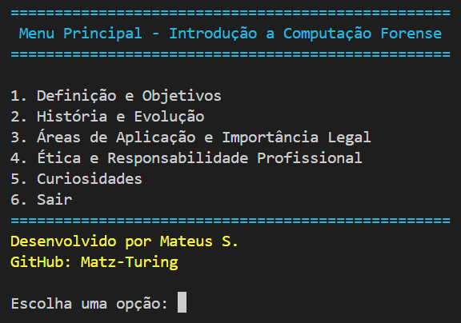

# Introduction to Digital Forensics

## Sobre o Projeto

Este projeto é uma aplicação de console desenvolvida em C# que oferece uma introdução ao campo da computação forense. A computação forense é uma disciplina crucial na ciência forense digital que envolve a coleta, análise e preservação de evidências digitais em um ambiente legal. O objetivo principal é ajudar profissionais e interessados a entender os conceitos fundamentais, a evolução histórica e a importância legal da computação forense, bem como os princípios éticos e responsabilidades envolvidas na prática dessa disciplina.

## Funcionalidades

A aplicação possui um menu interativo com as seguintes opções:

1. **Definição e Objetivos da Computação Forense**  
   Fornece uma visão geral da computação forense, seus objetivos principais e a importância de cada um deles no contexto legal e investigativo.
   
2. **História e Evolução da Computação Forense**  
   Apresenta a evolução da computação forense desde seus primeiros dias até o presente, destacando marcos importantes e avanços tecnológicos.
   
3. **Áreas de Aplicação e Importância Legal**  
   Explora as várias áreas onde a computação forense é aplicada e discute a importância legal da disciplina em diferentes contextos.
   
4. **Ética e Responsabilidade Profissional**  
   Discute os princípios éticos fundamentais e as responsabilidades profissionais que os especialistas em computação forense devem seguir.
   
5. **Curiosidades sobre a Introdução à Computação Forense**  
   Oferece curiosidades e fatos interessantes sobre o campo da computação forense.

## Créditos

Desenvolvido por **Mateus S.**  
GitHub: [Matz-Turing](https://github.com/Matz-Turing)
